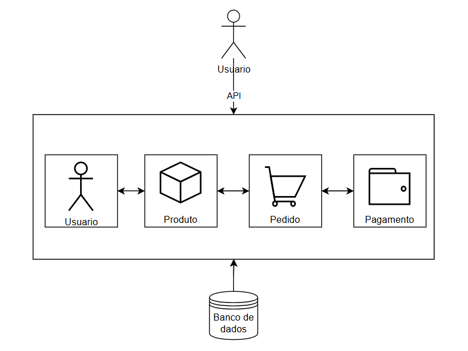
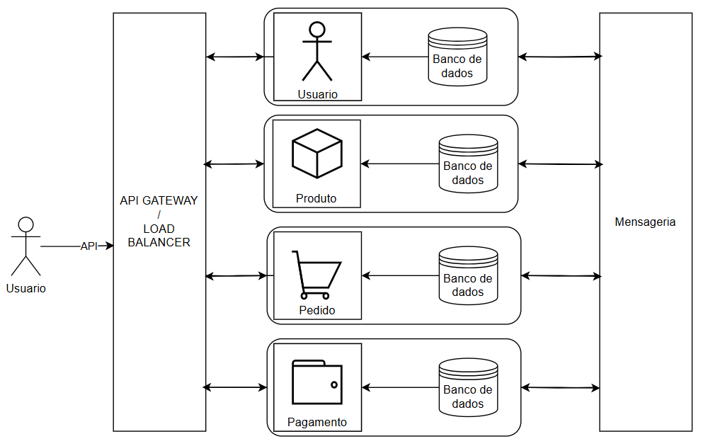

# Escolha um idioma / Choose one language / Elige un idioma

- [PT-BR](#pt-br)  
- [EN-US](#en-us)  
- [ES-ES](#es-es)

---

### <a name="pt-br"></a>PT-BR

# Tópicos:
- [Motivação](#motivacao-pt-br)  
- [Como foi feito](#como-foi-feito)  
- [Como rodar o projeto](#como-rodar-o-projeto)
- [Conclusao](#conclusao-pt-br)  

---

### <a name="motivacao-pt-br"></a>Motivação

Este projeto foi desenvolvido como base prática para o Trabalho de Conclusão de Curso (TCC), cujo objetivo foi implementar dois sistemas backend para uma aplicação de e-commerce: um utilizando arquitetura monolítica e outro baseado em microsserviços. A partir disso, foram realizados testes de carga com o uso das ferramentas Grafana e K6, permitindo uma comparação objetiva entre os dois modelos arquiteturais.

A motivação principal foi compreender, na prática, as vantagens, limitações e impactos de cada abordagem em diferentes cenários de uso. O estudo também buscou avaliar aspectos como desempenho sob diferentes volumes de requisições, escalabilidade, tolerância a falhas, complexidade de desenvolvimento e custo de infraestrutura.

Os resultados obtidos contribuíram não apenas para a validação de conceitos teóricos abordados ao longo da graduação, mas também forneceram uma base sólida para tomada de decisão sobre qual arquitetura adotar em projetos futuros, especialmente em função do porte e das necessidades do sistema a ser desenvolvido.

### <a name="como-foi-feito"></a>Como foi feito

Este projeto foi desenvolvido utilizando Docker, .NET 8, Entity Framework e SQL Server como banco de dados, com o objetivo de implementar o back-end de um e-commerce para explorar os conceitos de arquitetura monolítica e de microsserviços.

Para realizar testes de carga e coletar dados para embasar meu TCC, utilizei as ferramentas Grafana e k6. Na arquitetura de microsserviços, também foi implementado o Kong API Gateway, atuando como balanceador de carga (load balancer).

#### Arquitetura Monolítica



#### Arquitetura de Microsserviços



### <a name="como-rodar-o-projeto"></a>Como rodar o projeto  

#### Pré-requisitos

- Docker instalado na máquina.

#### Observações

Por padrão, o `docker-compose` está configurado para subir **tanto o monolito quanto os microsserviços**. Caso deseje executar apenas um deles, comente (`#`) as linhas correspondentes ao serviço que não deseja iniciar no arquivo `docker-compose.yml`.

Cada serviço está limitado ao uso de **2 CPUs** e **1 GB de RAM**. Se quiser alterar esse limite, remova ou comente os trechos correspondentes no mesmo arquivo.

Para ajustar a distribuição de carga entre os serviços, edite o arquivo `Ecommerce/kong/kong.yml` e modifique as configurações de rotas e serviços conforme necessário.

#### Passos para Executar

1. Clone o repositório:

    ```bash
    git clone <URL-do-repositório>  
     ```

2. Acesse a pasta do projeto via terminal:

     ``` bash
     cd Ecommerce
     ```
3. Execute o Docker Compose:
     ``` bash
     docker-compose up
     ```

O Docker irá baixar as imagens necessárias e inicializar os serviços automaticamente.

#### Acesso às Aplicações
Monolito:

O monolito estará disponível na porta 5000. Para acessar a interface Swagger, utilize:

http://localhost:5000/swagger/index.html

Microsserviços:

Os microsserviços estarão disponíveis através do Load Balancer (Kong) na porta 8000. A estrutura de URL para acesso via Swagger é:

http://localhost:8000/{serviço}/api/{Serviço}/swagger/index.html

Exemplos

Serviço de Pagamento:
http://localhost:8000/pagamento/api/Pagamento/swagger/index.html

Serviço de Usuário:
http://localhost:8000/usuario/api/Usuario/swagger/index.html

Serviço de Pedido:
http://localhost:8000/pedido/api/Pedido/swagger/index.html

Serviço de Produto:
http://localhost:8000/produto/api/Produto/swagger/index.html

### <a name="conclusao-pt-br"></a>Conclusao

Para o desenvolvimento de aplicações pequenas, como MVPs, considero mais vantajosa a utilização da arquitetura monolítica, pois permite entregar resultados de forma mais rápida e eficiente. Durante o desenvolvimento com microsserviços, precisei revisar e adaptar diversas decisões para garantir que cada serviço fosse verdadeiramente independente e escalável, o que tornou o processo mais complexo.

Nos testes realizados, a arquitetura monolítica apresentou melhor desempenho sob cargas menores de usuários e requisições. Já os microsserviços se mostraram mais eficientes em cenários com cargas elevadas, devido à possibilidade de escalar individualmente os serviços. No entanto, essa abordagem apresentou uma taxa ligeiramente maior de falhas nas requisições, em torno de 4% durante os picos de teste.

Acredito que a principal dificuldade no uso de microsserviços está em compreender bem os limites e responsabilidades de cada serviço. Embora os testes tenham sido realizados localmente, é importante destacar que, em um ambiente de produção com máquinas virtuais, a infraestrutura necessária para os microsserviços resultaria em custos significativamente mais altos.

---

### <a name="en-us"></a>EN-US

# Topics:
- [Motivation](#motivation)  
- [How it was built](#how-it-was-built)  
- [How to run the project](#how-to-run-the-project)
- [Conclusion](#conclusion)  

---

### <a name="motivation"></a>Motivation

This project was developed as a practical foundation for my final undergraduate thesis, which aimed to implement two backend systems for an e-commerce application: one using a monolithic architecture and the other based on microservices. Load testing was performed using Grafana and K6 to enable an objective comparison between the two architectural models.

The main motivation was to understand, in practice, the advantages, limitations, and impacts of each approach in different usage scenarios. The study also aimed to evaluate aspects such as performance under various request volumes, scalability, fault tolerance, development complexity, and infrastructure cost.

The results contributed not only to validating theoretical concepts covered during my academic journey but also provided a solid foundation for decision-making regarding which architecture to adopt in future projects, especially based on the size and requirements of the system to be developed.

### <a name="how-it-was-built"></a>How It Was Built

This project was developed using Docker, .NET 8, Entity Framework, and SQL Server as the database, with the goal of implementing the backend of an e-commerce system and exploring the concepts of monolithic and microservices architectures.

To perform load tests and collect data to support my thesis, I used Grafana and K6. In the microservices architecture, I also implemented the Kong API Gateway to act as a load balancer.

#### Monolithic Architecture


#### Microservices Architecture


### <a name="how-to-run-the-project"></a>How to Run the Project

#### Prerequisites

- Docker installed on your machine.

#### Notes

By default, `docker-compose` is configured to start **both the monolithic and microservices architectures**. If you want to run only one of them, comment (`#`) the corresponding service lines in the `docker-compose.yml` file.

Each service is limited to **2 CPUs** and **1 GB of RAM**. If you want to change these limits, remove or comment out the related sections in the same file.

To adjust load distribution between services, edit the `Ecommerce/kong/kong.yml` file and modify the route and service settings as needed.

#### Steps to Run

1. Clone the repository:

    ```bash
    git clone <repository-url>
    ```
2. Navigate to the project folder:
    ``` bash 
    cd Ecommerce
    ```
3. Start Docker Compose:
     ```
     docker-compose up
     ```

Docker will download the necessary images and initialize all services automatically.

#### Accessing the Applications:
Monolithic Architecture:

The monolithic system will be available on port 5000. To access the Swagger interface, visit:

http://localhost:5000/swagger/index.html

Microservices Architecture:

The microservices will be available through the Kong Load Balancer on port 8000. The Swagger access URL structure is:

http://localhost:8000/{service}/api/{Service}/swagger/index.html

Examples:

Payment Service:
http://localhost:8000/pagamento/api/Pagamento/swagger/index.html

User Service:
http://localhost:8000/usuario/api/Usuario/swagger/index.html

Order Service:
http://localhost:8000/pedido/api/Pedido/swagger/index.html

Product Service:
http://localhost:8000/produto/api/Produto/swagger/index.html

### <a name="conclusion"></a>Conclusion
For the development of small applications, such as MVPs, I found the monolithic architecture to be more advantageous, as it allows for faster and more efficient delivery. During the development of the microservices architecture, I had to revisit and adapt several design decisions to ensure that each service was truly independent and scalable, which made the process more complex.

In the tests performed, the monolithic architecture showed better performance under low user and request loads. Microservices, on the other hand, proved to be more efficient under high-load scenarios due to the ability to scale services independently. However, this approach showed a slightly higher request failure rate, around 4% during peak loads.

I believe the main challenge of working with microservices lies in properly understanding the boundaries and responsibilities of each service. Although all tests were conducted locally, it is important to note that in a production environment with virtual machines, the infrastructure cost of microservices would be significantly higher.

---

### <a name="es-es"></a>ES-ES

# Temas:
- [Motivación](#motivacion)  
- [Cómo se hizo](#como-se-hizo)  
- [Cómo ejecutar el proyecto](#como-ejecutar-el-proyecto)
- [Conclusión](#conclusion-es)  

---

### <a name="motivacion"></a>Motivación

Este proyecto fue desarrollado como base práctica para mi Trabajo de Fin de Grado (TFG), cuyo objetivo fue implementar dos sistemas backend para una aplicación de comercio electrónico: uno utilizando arquitectura monolítica y otro basado en microservicios. Se realizaron pruebas de carga utilizando Grafana y K6, lo que permitió una comparación objetiva entre ambos modelos arquitectónicos.

La motivación principal fue comprender, en la práctica, las ventajas, limitaciones e impactos de cada enfoque en diferentes escenarios de uso. El estudio también buscó evaluar aspectos como el rendimiento bajo diferentes volúmenes de solicitudes, escalabilidad, tolerancia a fallos, complejidad de desarrollo y costos de infraestructura.

Los resultados obtenidos contribuyeron no solo a la validación de conceptos teóricos abordados durante la carrera, sino también proporcionaron una base sólida para la toma de decisiones sobre qué arquitectura adoptar en proyectos futuros, especialmente según el tamaño y las necesidades del sistema a desarrollar.

### <a name="como-se-hizo"></a>Cómo se hizo

Este proyecto fue desarrollado utilizando Docker, .NET 8, Entity Framework y SQL Server como base de datos, con el objetivo de implementar el backend de una aplicación de comercio electrónico y explorar los conceptos de arquitecturas monolítica y de microservicios.

Para realizar las pruebas de carga y recopilar datos para respaldar mi TFG, utilicé las herramientas Grafana y K6. En la arquitectura de microservicios también implementé Kong API Gateway, actuando como balanceador de carga.

#### Arquitectura Monolítica


#### Arquitectura de Microservicios


### <a name="como-ejecutar-el-proyecto"></a>Cómo ejecutar el proyecto

#### Requisitos previos

- Tener Docker instalado en la máquina.

#### Observaciones

Por defecto, el archivo `docker-compose` está configurado para levantar **tanto la arquitectura monolítica como la de microservicios**. Si deseas ejecutar solo una de ellas, comenta (`#`) las líneas correspondientes al servicio que no quieras iniciar en el archivo `docker-compose.yml`.

Cada servicio está limitado al uso de **2 CPUs** y **1 GB de RAM**. Si deseas modificar este límite, elimina o comenta las secciones correspondientes en el mismo archivo.

Para ajustar la distribución de carga entre los servicios, edita el archivo `Ecommerce/kong/kong.yml` y modifica las configuraciones de rutas y servicios según sea necesario.

#### Pasos para ejecutar

1. Clonar el repositorio:

    ```bash
    git clone <url-del-repositorio>
    ```
2. Acceder a la carpeta del proyecto por terminal:
     ``` bash
     cd Ecommerce
     ```
3. Ejecutar Docker Compose:
     ```
     docker-compose up
     ```
     
Docker descargará las imágenes necesarias e iniciará todos los servicios automáticamente.

#### Acceso a las aplicaciones
Arquitectura Monolítica:

El sistema monolítico estará disponible en el puerto 5000. Para acceder a la interfaz Swagger, visita:

http://localhost:5000/swagger/index.html

Arquitectura de Microservicios:

Los microservicios estarán disponibles a través del balanceador de carga (Kong) en el puerto 8000. La estructura de la URL para acceder vía Swagger es:


http://localhost:8000/{servicio}/api/{Servicio}/swagger/index.html
Ejemplos
Servicio de Pago:
http://localhost:8000/pagamento/api/Pagamento/swagger/index.html

Servicio de Usuario:
http://localhost:8000/usuario/api/Usuario/swagger/index.html

Servicio de Pedido:
http://localhost:8000/pedido/api/Pedido/swagger/index.html

Servicio de Producto:
http://localhost:8000/produto/api/Produto/swagger/index.html

### <a name="conclusion-es"></a>Conclusión
Para el desarrollo de aplicaciones pequeñas, como MVPs, considero más ventajosa la utilización de la arquitectura monolítica, ya que permite entregar resultados de forma más rápida y eficiente. Durante el desarrollo con microservicios, tuve que revisar y adaptar varias decisiones para asegurar que cada servicio fuera verdaderamente independiente y escalable, lo que hizo el proceso más complejo.

En las pruebas realizadas, la arquitectura monolítica mostró un mejor rendimiento bajo cargas bajas de usuarios y solicitudes. Por otro lado, los microservicios fueron más eficientes en escenarios de alta carga, gracias a la posibilidad de escalar servicios individualmente. Sin embargo, este enfoque presentó una tasa de fallos ligeramente superior, alrededor del 4% durante los picos de prueba.

Considero que la principal dificultad al trabajar con microservicios es comprender bien los límites y responsabilidades de cada servicio. Aunque las pruebas se realizaron localmente, es importante destacar que, en un entorno de producción con máquinas virtuales, la infraestructura necesaria para microservicios tendría un costo significativamente mayor.
